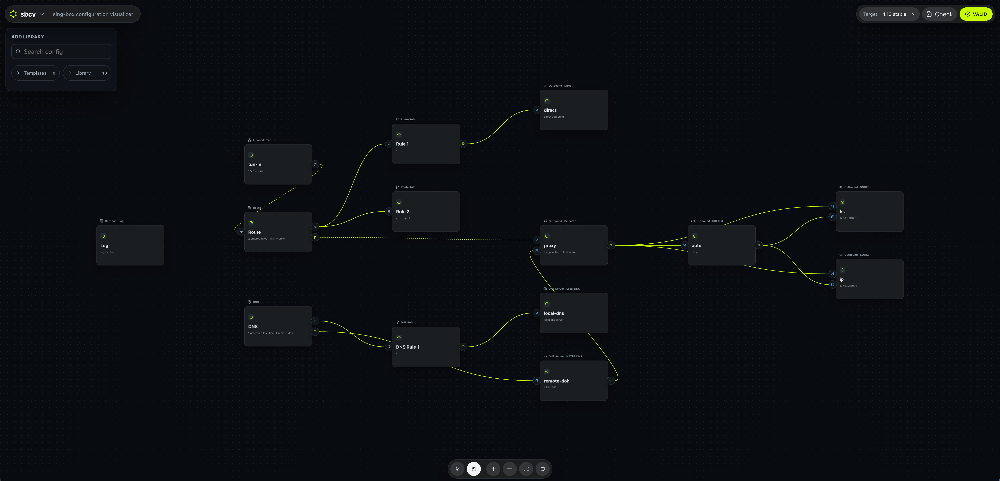

# sbcv — sing-box configuration visualizer

> Build, validate, and understand [sing-box](https://github.com/SagerNet/sing-box) configs on a visual canvas — instead of hand-writing JSON.

[](LICENSE)
[](https://sbcv.app)
[](#contributing)

**sbcv** turns a sing-box `config.json` into a drag-and-drop canvas: drop inbounds, outbounds, nodes, DNS servers, and routing rules, wire them together, and validate with the **real** `sing-box check` — all in one browser tab.

**[→ Open sbcv.app](https://sbcv.app)** · Free · Open source (MIT) · No install · No login

[](https://sbcv.app)

---

## Why sbcv?

### 1. Drag, don't type — typos become impossible

Build your config on a visual canvas: drag inbounds, outbounds, endpoints, DNS servers, route rules, and rule-sets, then wire them together. Every enum is a dropdown and every tag reference is a connection — so the misspelled field names and broken references that quietly wreck a hand-written config simply can't happen.

> Instead of hunting through hundreds of lines of JSON to add a "domestic-direct, foreign-proxied" routing rule, you drag the rule out, pick from a dropdown, and draw one wire — the reference wires itself up.

### 2. One click runs the official validator — know it's correct *before* you load it

Hit **Check** and sbcv runs the official `sing-box check` binary server-side, against the sing-box release channel you target — **Testing**, **Stable** (the default), or **Legacy** (currently 1.14 / 1.13 / 1.12). We follow sing-box's own release cadence, so each channel always tracks the current upstream build — never a pinned, going-stale snapshot. It's the same verdict sing-box itself would give — not a simulation, not a guess, and nothing to install locally.

> No more *edit → load into your client → it won't start → guess what broke → repeat.* You see exactly which line is wrong before the config ever reaches your client. Want to try the next release? Flip from **Stable** to **Testing**, hit Check, and every deprecated or incompatible field lights up instantly.

### 3. JSON stays the source of truth — lossless both ways, nothing stored

The canvas is just a readable view; the canonical sing-box JSON is always the source of truth. Switch between the visual editor and raw JSON as much as you like — nothing is lost or silently rewritten. **Import** an existing config to start editing, **Export** back to JSON when you're done.

> Handed a 400-line config you didn't write? Import it and the whole topology lays out at a glance — where traffic enters, which rule it hits, which outbound it leaves by. And it all runs in one browser tab: no install, no account, and your config is never persisted on the server.

---

## Use it

1. Open **[sbcv.app](https://sbcv.app)** and pick your sing-box release channel — Testing, Stable, or Legacy — in the top bar.
2. Drag nodes onto the canvas, or **Import** an existing config to edit.
3. Wire nodes together and fill in the dropdowns.
4. Hit **Check** to validate, then **Export JSON** when you're happy.

---

## Run it yourself

```bash
git clone https://github.com/JegoVPN/sbcv
cd sbcv
pnpm install
pnpm dev          # http://localhost:5173
pnpm build        # tsc -b && vite build → dist/
pnpm test         # vitest
```

---

## How it works

- **Canonical config first.** The `SingBoxConfig` domain model is the source of truth. The React Flow canvas is a *derived* view — every edit flows through domain commands that update the canonical JSON, so visual and raw never drift apart.
- **Real validation, in the browser.** The remote `sing-box check` validator is a Cloudflare Worker that fans out to one Container per sing-box release channel — Testing, Stable, and Legacy — each kept current with upstream, so the verdict matches the binary you'd run yourself.
- **Private by default.** Configs are never persisted on the server. No account, no telemetry.

**Tech stack:** Vite · React · [React Flow](https://reactflow.dev) · Zustand · TypeScript · Cloudflare Workers + Containers.

---

## Contributing

Issues and PRs welcome. Especially useful:

- **A sing-box field is missing from the inspector** → open an issue with the field name + doc link.
- **A provider's subscription JSON fails to import** → attach a redacted copy.
- **A diagnostic is a false positive** → paste the offending snippet.

---

## License

MIT © 2026 — see [LICENSE](LICENSE).

## Acknowledgements

- **[SagerNet/sing-box](https://github.com/SagerNet/sing-box)** — sbcv just makes its config easier to live with.
- **[Linux.do](https://linux.do)** — early feedback, bug reports, and keeping the project pointed at real user needs.
- **[V2EX](https://www.v2ex.com)** — discussion threads that surfaced edge cases worth supporting.
